# Инструкция по эксплуатации IvkExportTool

## 1. Общие сведения

### 1.1 Назначение программы

**IvkExportTool** — это кроссплатформенное приложение для экспорта таблиц из базы данных MySQL в SQL-файлы. Программа предоставляет удобный графический интерфейс для выбора таблиц и выполнения экспорта с сохранением полной структуры и данных.

### 1.2 Основные возможности

- Подключение к базе данных MySQL
- Просмотр списка всех таблиц в базе данных
- Поиск и фильтрация таблиц по имени
- Выбор одной или нескольких таблиц для экспорта
- Экспорт выбранных таблиц в SQL-формат

### 1.3 Системные требования

- **Операционная система**: Windows 10/11, Linux (Ubuntu 20.04+, Debian 11+)
- **Оперативная память**: минимум 512 МБ
- **Свободное место на диске**: 100 МБ для программы + место для экспортируемых файлов
- **Доступ к сети**: для подключения к серверу MySQL
- **Права доступа**: права на чтение таблиц в базе данных MySQL

---

## 2. Запуск программы

### 2.1 Первый запуск

1. Распакуйте архив с программой в удобную папку
2. Запустите исполняемый файл:
   - **Windows**: `IvkExportTool.exe`
   - **Linux**: `./IvkExportTool` (предварительно выдайте права на выполнение: `chmod +x IvkExportTool`)

3. При первом запуске автоматически откроется окно подключения к базе данных

**[СКРИНШОТ 1: Окно подключения при первом запуске]**

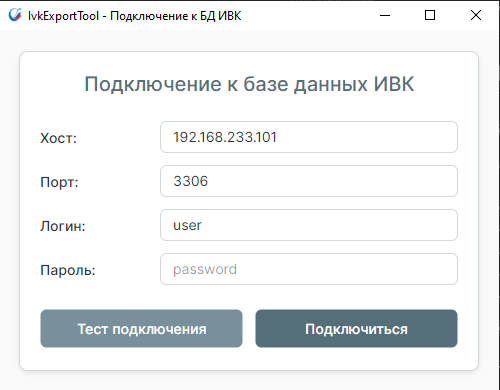

---

## 3. Подключение к базе данных

### 3.1 Ввод параметров подключения

В окне подключения необходимо заполнить следующие поля:

1. **Хост** — адрес сервера базы данных (например: `localhost`, `192.168.1.100`, `db.example.com`)
2. **Порт** — порт подключения к MySQL (по умолчанию: `3306`)
3. **Логин** — логин для доступа к базе данных
4. **Пароль** — пароль пользователя

**[СКРИНШОТ 2: Заполненная форма подключения]**

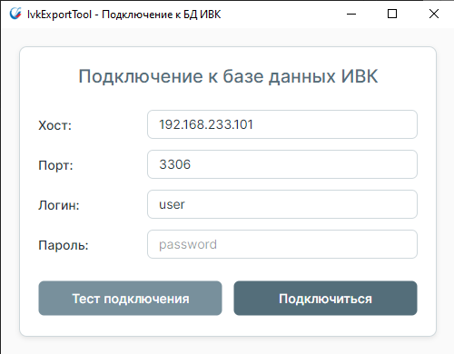

### 3.2 Проверка подключения

После заполнения всех полей нажмите кнопку **"Подключиться"**.

**Возможные результаты:**

✅ **Успешное подключение:**
- Появится сообщение об успешном подключении
- Автоматически откроется главное окно программы с списком таблиц

**[СКРИНШОТ 3: Сообщение об успешном подключении]**

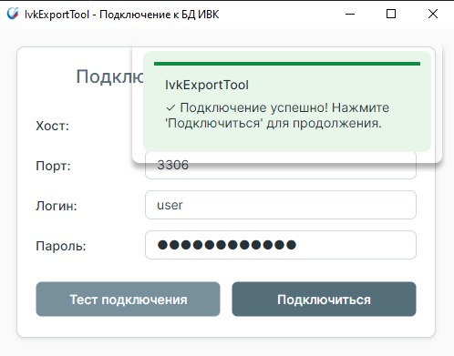

❌ **Ошибка подключения:**
- Появится сообщение об ошибке с описанием проблемы
- Проверьте правильность введенных данных
- Убедитесь в доступности сервера базы данных

**[СКРИНШОТ 4: Сообщение об ошибке подключения]**

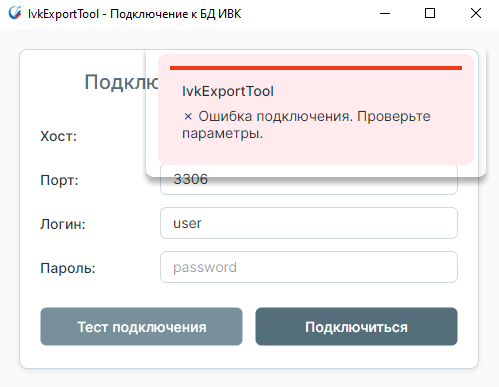

### 3.3 Сохранение параметров подключения

При успешном подключении параметры автоматически сохраняются. При следующем запуске программы:
- Поля будут автоматически заполнены сохраненными значениями
- Пароль также будет восстановлен автоматически

**Где хранятся настройки:**
- Настройки хранятся в стандартных папках конфигурации ОС:
  - **Windows**: `%APPDATA%\IvkExportTool\settings.json`
  - **Linux**: `~/.config/IvkExportTool/settings.json`
- **Пароль сохраняется в зашифрованном виде** для удобства повторного подключения
- Также сохраняется последняя папка для экспорта

---

## 4. Работа с главным окном

### 4.1 Обзор интерфейса

После успешного подключения открывается главное окно программы, которое состоит из следующих элементов:

**[СКРИНШОТ 5: Главное окно программы]**

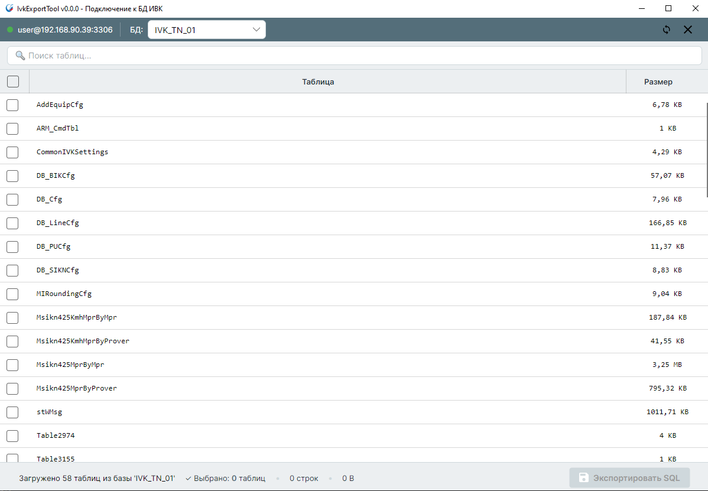

1. **Заголовок окна** — отображает версию программы и название подключенной базы данных
2. **Поле поиска** — для фильтрации таблиц по имени
3. **Таблица с данными** — список всех таблиц в базе данных
4. **Чекбокс в заголовке** — для выбора/снятия выбора всех таблиц
5. **Кнопки управления выбором** — "Выбрать все" / "Снять выбор"
6. **Кнопка "Экспорт"** — для начала экспорта выбранных таблиц
7. **Кнопка "Отключиться"** — для подключения к другой базе данных
8. **Строка состояния** — отображает количество выбранных таблиц

### 4.2 Информация о таблицах

В таблице отображаются следующие столбцы:

| Столбец | Описание |
|---------|----------|
| ☑ (чекбокс) | Выбор таблицы для экспорта |
| **Имя таблицы** | Название таблицы в базе данных |
| **Размер** | Размер таблицы (автоматически в B, KB, MB или GB) |

**[СКРИНШОТ 6: Пример отображения таблиц с различными размерами]**

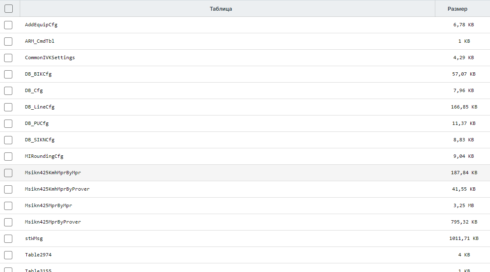

---

## 5. Фильтрация и поиск таблиц

### 5.1 Использование поиска

Для быстрого поиска нужной таблицы:

1. Кликните в поле поиска в верхней части окна
2. Начните вводить название таблицы (или его часть)
3. Список таблиц автоматически отфильтруется
4. Поиск не чувствителен к регистру

**Примеры:**
- Ввод `users` покажет таблицы: `users`, `users_logs`, `admin_users`
- Ввод `2024` покажет таблицы: `data_2024`, `reports_2024_01`

**[СКРИНШОТ 7: Использование фильтра поиска]**

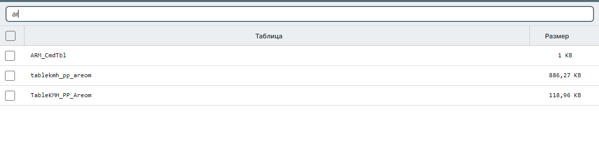

### 5.2 Очистка фильтра

Для отображения всех таблиц снова:
- Очистите поле поиска (удалите весь текст)

---

## 6. Выбор таблиц для экспорта

### 6.1 Выбор отдельных таблиц

Для выбора конкретной таблицы:
- Кликните на чекбокс в строке таблицы
- Повторный клик снимет выбор

**[СКРИНШОТ 8: Несколько выбранных таблиц]**

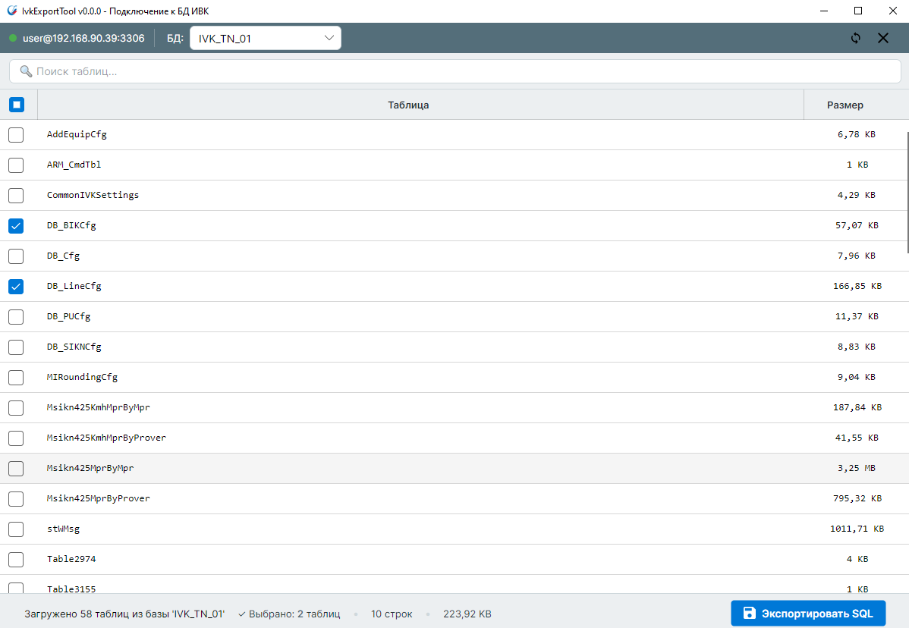

### 6.2 Выбор всех таблиц

Для выбора всех отображаемых таблиц используйте один из способов:

 - Кликните на чекбокс в заголовке таблицы

**[СКРИНШОТ 9: Все таблицы выбраны (чекбокс в заголовке отмечен)]**

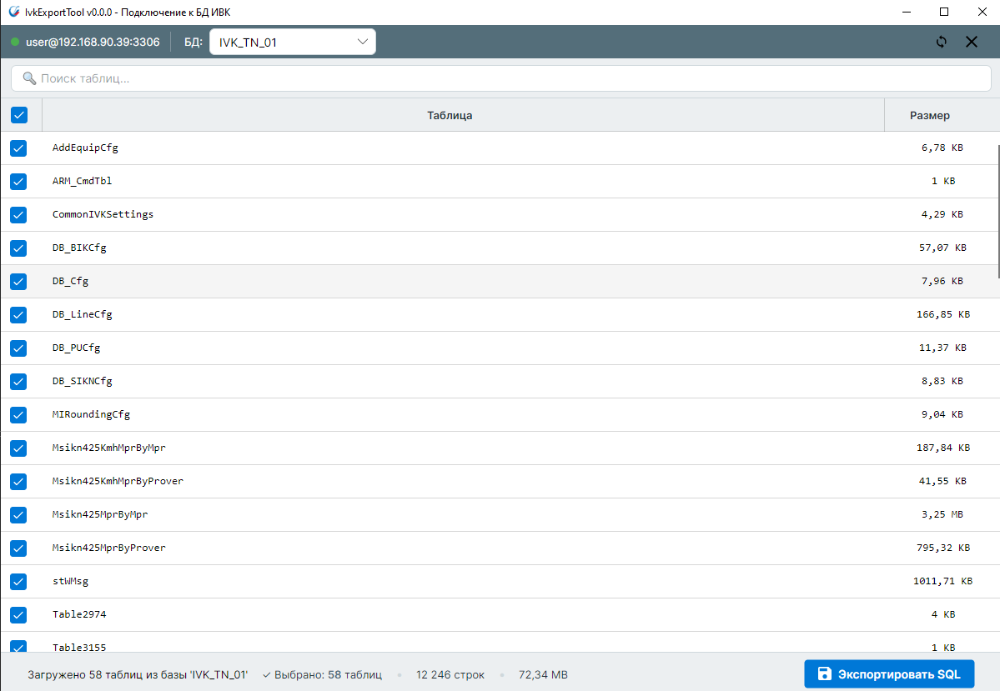

### 6.3 Снятие выбора

Для снятия выбора со всех таблиц:
- Кликните на чекбокс в заголовке таблицы (если все таблицы выбраны)

### 6.4 Частичный выбор

Если выбраны не все таблицы, чекбокс в заголовке будет показывать состояние "частичный выбор" (квадрат или тире). Клик по нему выберет все оставшиеся таблицы.

**[СКРИНШОТ 10: Частичный выбор таблиц]**

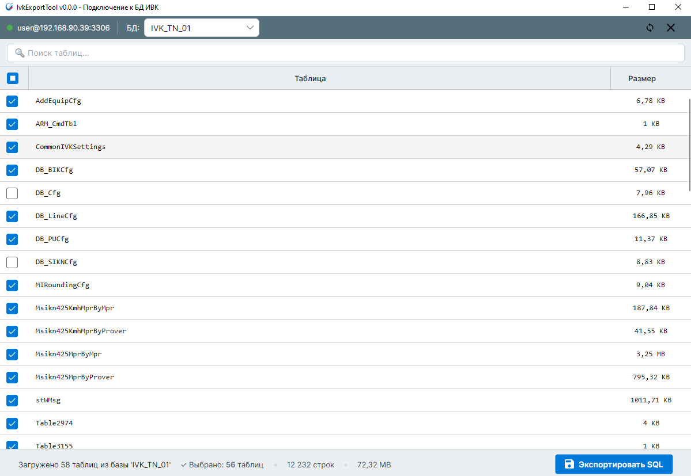

### 6.5 Выбор с использованием фильтра

Вы можете комбинировать поиск и выбор:

1. Введите текст в поле поиска для фильтрации
2. Нажмите "Выбрать все" — выберутся только отфильтрованные таблицы
3. Очистите фильтр — выбранные таблицы останутся выбранными

**Пример:** Выбрать все таблицы с логами за 2024 год:
1. Введите `logs_2024` в поиск
2. Нажмите "Выбрать все"
3. Очистите поиск (если нужно увидеть полный список)

---

## 7. Экспорт данных

### 7.1 Запуск экспорта

После выбора необходимых таблиц:

1. Проверьте, что в строке состояния отображается правильное количество выбранных таблиц
2. Нажмите кнопку **"Экспорт"**

**[СКРИНШОТ 11: Кнопка "Экспорт" активна, показано количество выбранных таблиц]**

**Примечание:** Кнопка "Экспорт" активна только если выбрана хотя бы одна таблица.

### 7.2 Выбор места сохранения

После нажатия кнопки "Экспорт" откроется диалоговое окно выбора места сохранения файла:

**[СКРИНШОТ 12: Диалоговое окно сохранения файла]**

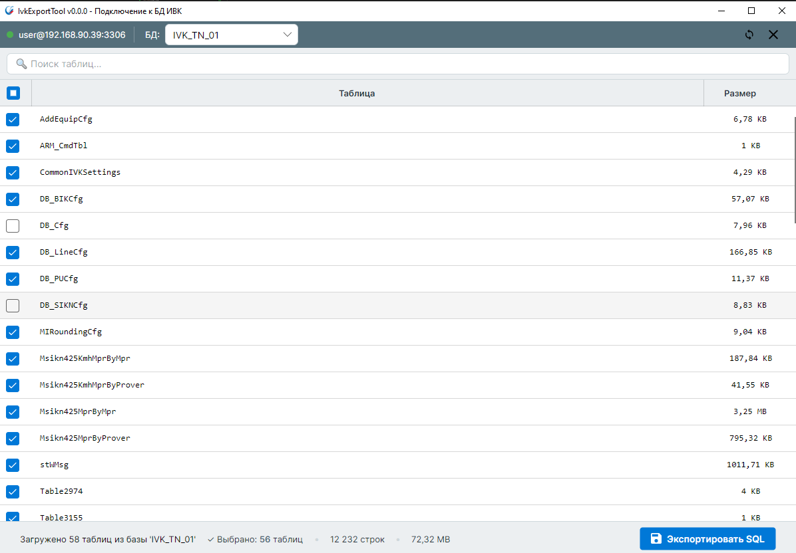

**Автоматическое имя файла:**
- **Одна таблица:** `НазваниеБД_НазваниеТаблицы_ДатаВремя.sql`
  - Пример: `ivk_database_users_20241121_143052.sql`
- **Несколько таблиц:** `НазваниеБД_ДатаВремя.sql`
  - Пример: `ivk_database_20241121_143052.sql`

**Действия:**
1. Выберите папку для сохранения
2. При необходимости измените предложенное имя файла
3. Нажмите **"Сохранить"**

**Примечание:** Программа запоминает последнюю выбранную папку и предложит её при следующем экспорте.

### 7.3 Процесс экспорта

После выбора места сохранения начнется процесс экспорта:

**[СКРИНШОТ 13: Окно с прогрессом экспорта]**

**Отображаемая информация:**
- Строка состояния с текущим действием и общим временем экспорта
- Например: `Экспорт таблицы 'users'... 00:00:15`
- Время показывает общую длительность экспорта всех выбранных таблиц
- Обновление прогресса происходит каждую секунду

**Во время экспорта:**
- Не закрывайте программу
- Дождитесь завершения процесса
- Время экспорта зависит от размера таблиц

### 7.4 Завершение экспорта

По завершении экспорта появится сообщение:

✅ **Успешный экспорт:**
- Сообщение: "Экспорт успешно завершен"
- Указан путь к сохраненному файлу
- Показано общее время экспорта

**[СКРИНШОТ 14: Сообщение об успешном экспорте]**

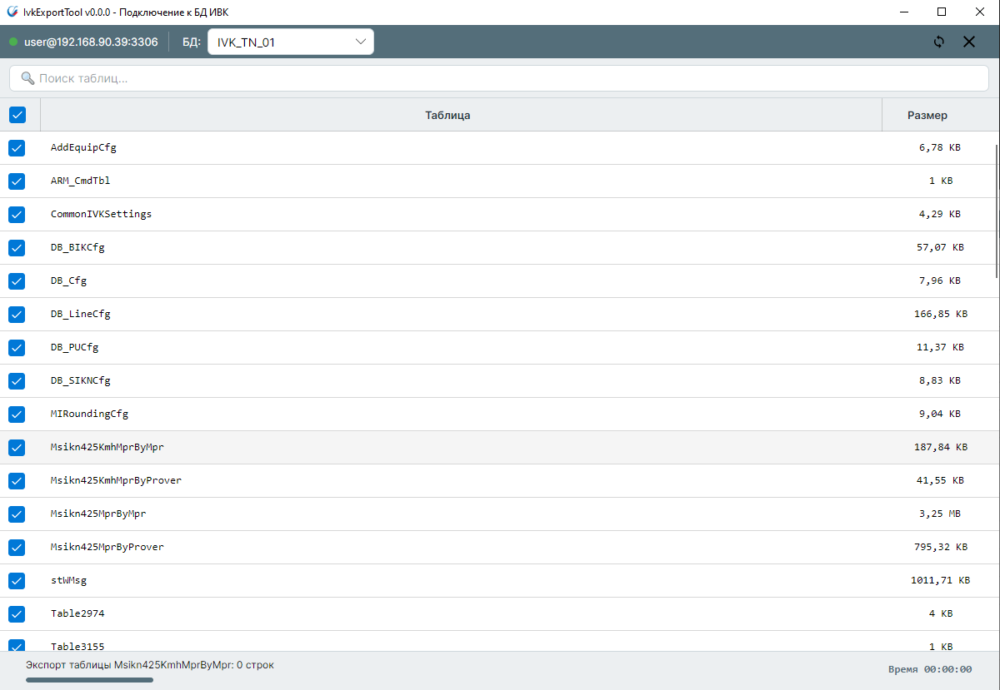

❌ **Ошибка экспорта:**
- Сообщение с описанием ошибки
- Возможные причины и рекомендации

### 7.5 Формат экспортируемого файла

Экспортированный SQL-файл содержит:
- Команды создания структуры таблиц (`CREATE TABLE`)
- Команды вставки всех данных (`INSERT INTO`)
- Все индексы, ключи и ограничения

Файл можно использовать для:
- Восстановления таблиц в другой базе данных
- Создания резервной копии
- Переноса данных между серверами

---

## 8. Смена подключения

### 8.1 Когда требуется смена подключения

Смена подключения может потребоваться для:
- Подключения к другой базе данных
- Подключения к другому серверу
- Смены пользователя или пароля

### 8.2 Процедура смены подключения

**[СКРИНШОТ 16: Кнопка "Сменить подключение"]**

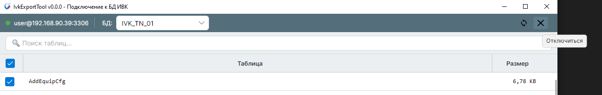

2. Главное окно закроется и откроется окно подключения
3. Введите новые параметры подключения
4. Нажмите "Подключиться"
5. При успешном подключении откроется главное окно с таблицами новой базы данных

**Примечание:** Позиция окна на экране сохраняется при переключении между окнами.

---

## 9. Возможные проблемы и решения

### 9.1 Не удается подключиться к базе данных

**Симптомы:**
- Сообщение об ошибке при подключении
- Долгое ожидание без результата

**Возможные причины и решения:**

| Проблема | Решение |
|----------|---------|
| Неверный адрес сервера | Проверьте правильность ввода хоста и порта |
| Неверные учетные данные | Уточните логин и пароль у администратора БД |
| Сервер недоступен | Убедитесь, что сервер MySQL запущен и доступен по сети |
| Брандмауэр блокирует соединение | Проверьте настройки брандмауэра |
| База данных не существует | Проверьте правильность имени базы данных |
| Нет прав доступа | Запросите необходимые права у администратора БД |

### 9.2 Не отображаются таблицы

**Возможные причины:**
- В базе данных нет таблиц
- У пользователя нет прав на просмотр таблиц
- Все таблицы отфильтрованы поиском

**Решение:**
- Очистите поле поиска
- Проверьте права доступа пользователя
- Убедитесь, что в базе данных есть таблицы

### 9.3 Ошибка при экспорте

**Возможные причины:**

| Ошибка | Решение |
|--------|---------|
| Недостаточно места на диске | Освободите место на диске |
| Нет прав на запись в папку | Выберите другую папку или запросите права доступа |
| Потеря соединения с БД | Проверьте соединение с сервером, повторите экспорт |
| Файл с таким именем уже открыт | Закройте файл или выберите другое имя |

### 9.4 Программа не запускается

**Windows:**
- Убедитесь, что установлены все обновления Windows
- Проверьте, не блокирует ли антивирус программу
- Запустите от имени администратора

**Linux:**
- Проверьте права на выполнение: `chmod +x IvkExportTool`
- Убедитесь, что установлены необходимые библиотеки
- Проверьте логи: `./IvkExportTool 2>&1 | tee error.log`

---

## 10. Советы по эффективной работе

### 10.1 Организация экспорта

✅ **Рекомендации:**
- Создайте отдельную папку для экспортов
- Используйте осмысленные имена файлов (программа предлагает их автоматически)
- Регулярно очищайте старые экспортные файлы

### 10.2 Работа с большими таблицами

При экспорте больших таблиц:
- Экспортируйте таблицы по отдельности или небольшими группами
- Убедитесь в наличии достаточного места на диске
- Учитывайте, что экспорт может занять продолжительное время
- Не закрывайте программу во время экспорта

### 10.3 Использование фильтров

Эффективное использование поиска:
- Используйте фильтр для поиска связанных таблиц (например, `order` найдет `orders`, `order_items`, `order_status`)
- Комбинируйте фильтр с "Выбрать все" для быстрого выбора группы таблиц
- Очищайте фильтр, чтобы увидеть полный список выбранных таблиц

### 10.4 Безопасность данных

⚠️ **Важно:**
- Экспортированные SQL-файлы содержат все данные из таблиц
- Храните экспорты в безопасном месте
- Не передавайте файлы экспорта неавторизованным лицам
- Регулярно создавайте резервные копии важных данных
- Удаляйте экспортные файлы после использования

**Хранение паролей:**
- Пароли сохраняются в зашифрованном виде в `settings.json`
- Настройки хранятся в стандартных папках ОС (`%APPDATA%` на Windows, `~/.config` на Linux)
- При переносе программы на другой компьютер потребуется ввести пароль заново

---

## 11. Техническая поддержка

### 11.1 Информация о версии

Версия программы отображается в заголовке главного окна:
- Формат: `IvkExportTool vX.Y.Z - Подключение к БД ИВК`
- Пример: `IvkExportTool v1.0.0 - Подключение к БД ИВК`

При обращении в техническую поддержку обязательно укажите версию программы.

### 11.2 Обратная связь

Для сообщения об ошибках или предложений по улучшению программы:
- Опишите проблему максимально подробно
- Укажите версию программы
- Приложите скриншоты (если возможно)
- Опишите шаги для воспроизведения проблемы

---

**Дата создания документа:** 21.11.2024
**Версия документа:** 1.0
**Версия программы:** 1.0.0+
